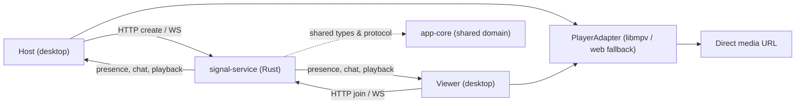
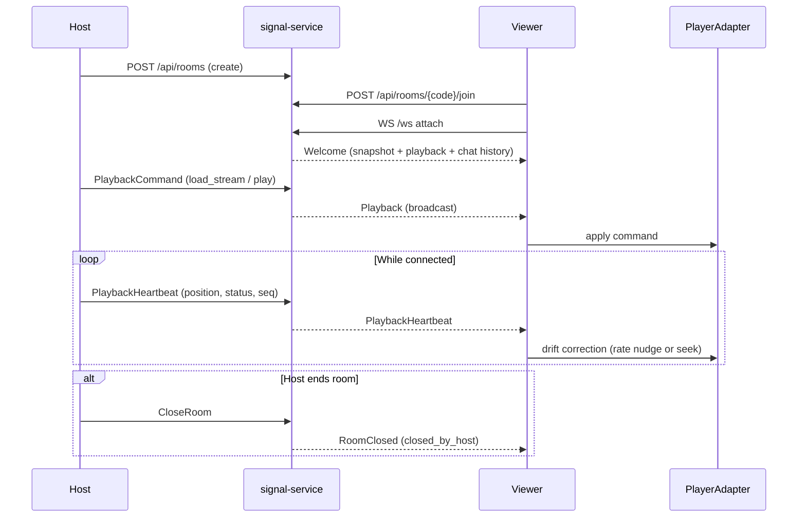
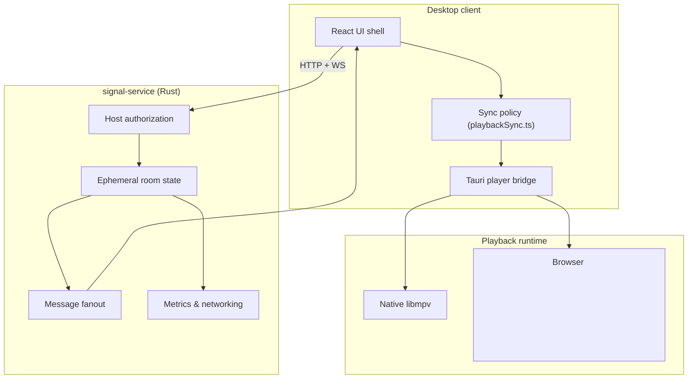

# Bharatiya Watch Party

Bharatiya Watch Party is a cross-platform desktop app for watching the same stream together, in sync. A host loads a direct media URL and drives playback; viewers join with a room code and follow a single shared timeline.

The project is built around one principle: synchronized playback should be host-authoritative and resilient, so every participant sees the same moment without one client's seek or stall desyncing the room.

## Why This Exists

Casual "watch together" tools usually fall back to "3, 2, 1, press play" and hope everyone stays aligned. The failure mode is constant drift: one viewer buffers, another scrubs, and the room quietly falls out of sync with no way to recover.

Bharatiya Watch Party changes the execution model. Instead of every client controlling its own player, only the host issues playback commands. Viewers receive those commands plus periodic heartbeats, and the client corrects local drift conservatively — nudging playback rate for small gaps and seeking only when it must.

This gives the system three practical properties:

- **One source of truth**: only the host can load, play, pause, seek, or stop for the room.
- **Self-healing sync**: viewers reconcile against host heartbeats and rejoin onto the current timeline after a reconnect.
- **Observable rooms**: presence, readiness, chat, and playback fanout are all visible to the operator and exposed as service metrics.

## System Overview



The signaling service is intentionally small and holds only ephemeral room state. Most surrounding code exists to make the playback lifecycle synchronized, observable, and easy to operate from local development through public testnets of the stream stack.

## Playback Lifecycle



The protocol recognizes a small set of server messages:

- `Welcome`: room snapshot, current playback state, self session id, and bounded chat history on attach or reconnect.
- `Presence`: updated participant list (joins, leaves, readiness, connectivity).
- `Chat`: a single broadcast chat message.
- `Playback`: a host-authoritative playback command fanned out to the room.
- `PlaybackHeartbeat`: the host's periodic timeline so viewers can correct drift.
- `RoomClosed`: the room ended (`host_disconnected`, `expired`, or `closed_by_host`).

## Domain Model

The shared types live in [crates/app-core](crates/app-core), so the Rust service and the TypeScript frontend agree on one protocol.

Key roles:

- `host`: the room creator; the only participant allowed to issue playback commands and close the room.
- `viewer`: joins with a room code; can chat and toggle readiness but follows the host timeline.
- `keeper of state`: the signal service holds ephemeral room state and fans messages out; it never persists media.

Key limits (see [crates/app-core/src/room.rs](crates/app-core/src/room.rs) and [services/signal-service/src/lib.rs](services/signal-service/src/lib.rs)):

- `MAX_VIEWERS`: ten viewers per room beyond the host.
- `MAX_CHAT_LENGTH`: 500 characters per chat message.
- `CHAT_HISTORY_LIMIT`: 50 recent messages replayed to late or reconnecting clients.
- `DEFAULT_ROOM_TTL_SECONDS`: rooms expire after four hours.

Core playback contract — the `PlayerAdapter` trait ([crates/app-core/src/player.rs](crates/app-core/src/player.rs)):

- `load_stream(url)`: load a direct media source.
- `play()` / `pause()` / `stop()`: transport control.
- `seek(position_ms)`: jump to a position.
- `state()` / `tracks()`: poll current `PlayerState` and the audio/subtitle `TrackCatalog`.
- `set_playback_rate(percent)`: smoothing lever for drift correction.
- `select_audio_track(id)` / `select_subtitle_track(id)`: per-client track selection.

## Trust & Authority Boundaries



The desktop client can recommend and request playback, but the service enforces who may drive the room. Viewer playback commands and viewer heartbeats are rejected; only the host's are accepted and fanned out. The client decides *how* to render and correct, never *whether* it is authoritative.

## Repository Layout

- [apps/desktop](apps/desktop): Tauri + React + TypeScript desktop shell — create/join flows, room UI, chat, player control dock, and the Tauri player bridge.
- [crates/app-core](crates/app-core): shared Rust domain — types, validation, wire protocol, and the `PlayerAdapter` contract.
- [services/signal-service](services/signal-service): Axum signaling service with ephemeral room state, presence, chat, playback fanout, and observability endpoints.
- [docs/specs](docs/specs): source-of-truth product, protocol, backend, UI, and test specs (`00` through `18`).
- [docs/implementation-status.md](docs/implementation-status.md): spec-by-spec implementation tracking.

Important modules:

- [apps/desktop/src/App.tsx](apps/desktop/src/App.tsx): room lifecycle, transport state, reconnect, and the operator UI.
- [apps/desktop/src/lib/playbackSync.ts](apps/desktop/src/lib/playbackSync.ts): heartbeat and drift-correction policy, isolated from the UI shell.
- [apps/desktop/src/lib/tauri.ts](apps/desktop/src/lib/tauri.ts): native (libmpv) vs browser-video player routing.
- [crates/app-core/src/protocol.rs](crates/app-core/src/protocol.rs): client/server message envelopes.
- [services/signal-service/src/lib.rs](services/signal-service/src/lib.rs): HTTP routes, WebSocket handling, room state, and metrics.

## Features

- Host-authoritative playback over WebSocket signaling
- Room create/join with client-side validation and copyable room codes
- Presence, readiness meter, and bounded room chat with duplicate suppression
- Host playback heartbeats with conservative viewer drift correction
- Playback-rate smoothing for medium drift before falling back to seek correction
- Late-join and reconnect onto the current timeline with recent chat replay
- Native `libmpv` playback with audio/subtitle track discovery and selection
- Browser `<video>` fallback when `libmpv` is unavailable (MP4/WebM and browser-native HLS)
- Standard and theater layout modes with a player-first room composition
- Reconnect-aware lobby, reconnecting, and closed-room surfaces
- React error boundary with a recoverable app-level fault screen
- Service observability: `/metrics` and `/networking` endpoints plus structured lifecycle logs
- Cross-platform desktop targets for Windows and macOS via Tauri
- CI for Rust (fmt/clippy/test) and frontend (typecheck/lint/build)

## Local Development

Install dependencies:

```powershell
npm install
```

Start the signaling service (required before creating or joining rooms):

```powershell
cargo run -p signal-service
```

The service listens on `http://127.0.0.1:4000` and allows local desktop/webview origins on `localhost:1420` / `127.0.0.1:1420`. The desktop client reads `VITE_SIGNAL_SERVICE_URL` and `VITE_SIGNAL_SERVICE_WS_URL`, defaulting to `http://127.0.0.1:4000` and `ws://127.0.0.1:4000`.

Run the desktop app in development:

```powershell
npm run desktop:dev
```

Build a desktop bundle:

```powershell
npm run desktop:build
```

If room actions fail with `Could not reach the signal service`, verify port `4000` is free and the backend is listening on `http://127.0.0.1:4000`.

## Running A Room

1. Start `signal-service`, then launch the desktop app.
2. On the landing screen, **Create a room** as host (or use the local playback harness to test a stream without a room).
3. Share the six-character room code; viewers **Join a room** with the code and a display name.
4. As host, paste a direct media URL, **Load**, then **Play** — commands fan out to all viewers.
5. Viewers follow the host timeline; the client corrects drift automatically. The host can **End room** at any time.

## Native Playback

- Primary playback target: `libmpv`
- Secondary media utility: `FFmpeg` (probing and diagnostics, not the runtime)

The Tauri backend tries to load `libmpv` from:

- `MPV_LIBRARY_PATH` if set
- Windows defaults such as `mpv-2.dll`, `libmpv-2.dll`, `mpv-1.dll`
- macOS defaults such as `libmpv.2.dylib`, `libmpv.dylib`

For full native playback, `libmpv` must be installed or bundled so the app can load it at runtime. If it is missing on Windows, the app surfaces a warning (e.g. `LoadLibraryExW failed`) and falls back to browser video playback — this does not block room creation or signaling.

The browser fallback is intended for local development and smoke testing. It supports MP4/WebM and browser-native HLS where the embedded WebView allows it. DASH `.mpd` streams still require native `libmpv` or a future MSE/DASH integration.

## Observability

The signaling service exposes operator visibility without external infrastructure:

- `GET /health`: liveness check.
- `GET /metrics`: in-memory room, transport, chat, playback, validation, and fanout counters.
- `GET /networking`: active WebSocket / direct-media network posture.

Structured logs cover room create/join/connect/disconnect/close, accepted chat, accepted playback commands, and playback fanout.

## Security & Authority Notes

- Only the host can issue playback commands or close the room; viewer commands and viewer heartbeats are rejected.
- Room state is ephemeral and expires after the room TTL; no media is stored by the service.
- Chat is length-limited and duplicate-suppressed by client message id.
- The browser fallback runs untrusted remote media in a WebView; prefer native `libmpv` for real sessions.
- TURN/STUN peer transport is disabled by design in v1; WebSocket signaling plus direct client media fetch is the active model.

## Verification

Primary checks:

```powershell
cargo fmt --all -- --check
cargo clippy --workspace --all-targets -- -D warnings
cargo test --workspace
npm run typecheck
npm run lint
npm run desktop:build
```

The Rust tests cover room create/join, presence, readiness, chat (including duplicate suppression and bounded replay), host-authoritative playback, viewer command rejection, reconnect with a stable session id, room closure, and a full-room fanout test of one host plus ten viewers. CI runs these on every push, pull request, and manual dispatch.

## Current Gaps

- Drift thresholds work end to end but still need measured tuning across real networks.
- Production metrics export, hosted dashboards, and a frontend telemetry pipeline are pending.
- Multi-client performance certification is not yet formalized.
- Packaging/bundling of `libmpv` for distribution still needs to be finished for release builds.

## Tracking Rule

This README should be updated whenever implementation meaningfully changes, so the repo keeps a current human-readable overview alongside the specs in [docs/specs](docs/specs) and the detailed status in [docs/implementation-status.md](docs/implementation-status.md).
